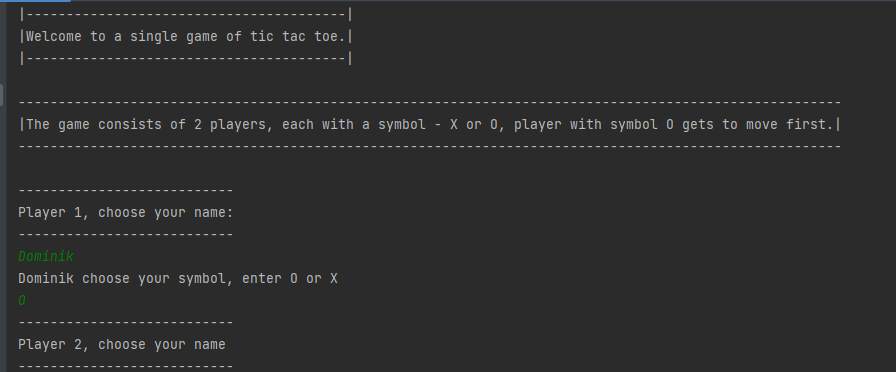
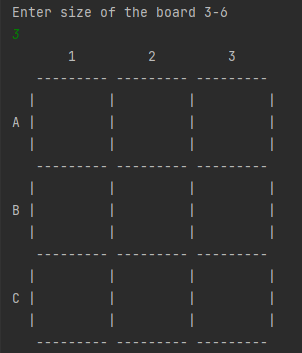
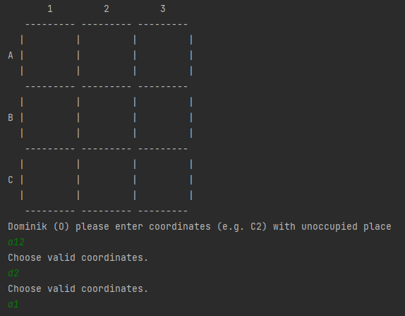
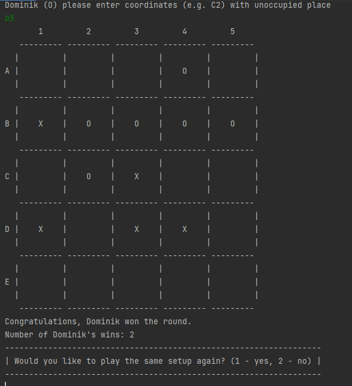

# Project Name
Console game of TicTacToe between 2 players.    
This part of the project is released as a console app, in order to practice using maven and to simulate usage of 
external library in my other projects library is in a different repository.       
Library part of TicTacToe can be found here: https://github.com/DominikSzczesniak/TicTacToe

## Table of Contents
* [General Info](#general-information)
* [Technologies Used](#technologies-used)
* [How to run](#how-to-run)
* [Features](#features)
* [Screenshots](#screenshots)
* [Project Status](#project-status)
* [Room for Improvement](#room-for-improvement)

## General Information
- It is my first bigger project.
- The purpose of the project was to use theoretical knowledge of OOP and SOLID in practice.
- Project architecture focused on ports and adapters.
- Application was made with TDD in mind.

## Technologies Used
- Java - version 17.0.5
- Maven
- GIT

## How to run
- Download library from: https://github.com/DominikSzczesniak/TicTacToe
- Build a jar file by using Maven install
- Now you can run the app from Launcher class

## Features
- Game supports board sizes of 3-6.
- Application keeps track of game history and players' ID in .txt files.

## Screenshots
**Preparing the game**

**Attempts to place symbol in non-existing fields**

**Game resolve**

App video showcase: https://www.youtube.com/watch?v=uEqRzmPEktM

## Project Status
Project is finished.

## Room for Improvement
- Make it possible to play against a computer.